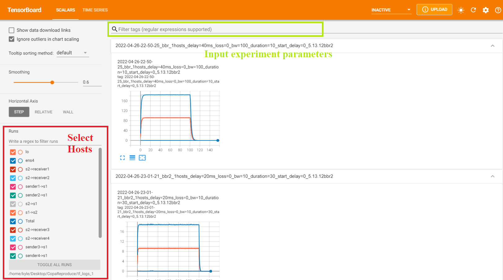

# Reproduce BBR Algorithm

## Intro
This project is intended to reproduce BBR purposed in paper "BBR: Congestion-Based Congestion Control, 2016 Neal Cardwell Yuchung Cheng etc", a new TCP Congestion Control Algorithm. We build a workflow from **network simulation**, **connection testing**, **logs analyzer** and **visualization**.

In General, we use `mininet` to simulate the network environment, `iperf3` to create connections and record the RTT and cwnd size, `ethstats` and `ifstat` to measure the traffic. We save the output of `iperf3`, `ethstats` and `ifstat` in log files and use analyzer to convert the raw l ogs into structured csv data. At last, we use tensorboard to visualize all the experiment results at the same time. 

```
   ┌─────────────┐
   │             │
   │  Start up   │
   │             │
   │             │
   └──────┬──────┘
          │
          │ testbed.py + experiments.py
   ┌──────▼──────┐
   │             │
   │    logs     │
   │             │
   │             │
   └──────┬──────┘
          │
          │ analyzer.py   
   ┌──────▼──────┐
   │             │
   │ analysis.csv│
   │             │
   │             │
   └──────┬──────┘
          │
          │ gen_tensorboard.py
   ┌──────▼──────┐
   │             │
   │             │
   │   tf_logs   │
   │             │
   └─────────────┘

```

## File structure
- Experiments Related
    - `testbed.py`, create network topology, run mininet and create connections. The core of all the experiments.
    -  `util.py`, wrap some command line tools like `iperf3` and `ethstats` to create connections easier.
    -  `experiments.py`, wrap some commonly used experiments parameters and environment sets in functions to run the tests in batch.
    - `run.sh`, virtual machine set up commands. Help install all the dependecies you need to run the experiments. But you need to switch different linux kernel on your own.
- Logs
    - `logs` every experiment will create a log dir under logs in the name of experiment parameter and time. For example, dir `2022-04-26-22-50-25_bbr_1hosts_delay=40ms_loss=0_bw=100_duration=10_start_delay=0_5.13.12bbr2` save the log file of experiment running in 2022-04-26-22-50-25, with one bbr flow, 40 ms delay, 0% loss rate, 100Mbps  bandwidth, duration 10 seconds and each flow start at the same time(start_delay = 0). What's more, this experiment is running on Linux Kernel 5.13.12bbr.
- Analyzer and Visualization
    - `analyzer.py` read all log files generated by `ethstats` and `ifstat`, convert them into structured csv data `analysis_microsecond`(from `ifstat`), `analysis_second`(from `ethstats`).
    - `iperf_analyzer.py` read all log files generated by `iperf`, and save them into `analysis_rec.csv`(from receiver iperf logs), `analysis_send.csv`(from sender iperf logs).
    - `gen_iperf_tensorboard.py` read structured csv data from iperf and draw tensorboard figures into `tf_send_logs`.
    - `gen_tensorboard.py` read structured csv data from ifstat and ethstat and save them into `tf_logs_1`, `tf_logs_10`.
- BBR
    - bbr save all different versions of bbr source code.

## How to see the results of the experiments
**I have upload my experiment results in this repository, So can skip step 1 and 2 to see them.**


If you want to see experiment results run by your own, you should do the experiments on your own and run all the following 3 steps.


1. First you need run `python3 analyzer/analyzer.py` and `python3 analyzer/iperf_analyzer.py` to generate `analysis.csv` files.
2. Next you need run `python3 analyzer/gen_tensorboard.py` and `python3 analyzer/gen_iperf_tensorbaord.py` to generate tensorboard logs files `tf_logs_1` and `tf_send_logs`.
3. You should run tensorboard commands `tensorboard --logdir tf_logs_1` or `tensorboard --logdir tf_send_logs` to visualize the experiment logs. tf_logs only show Troughput, and tf_send_logs also show RTT and Congestion Window size of sender Hosts.


If everything works well, you can see the figures rightly now. To quickly find the experiment you want, you can use regex expression to filter by the experiment parameters.


For example, `bbr_2hosts_delay=40ms_.*_duration=10` will find all the experiments running 2 bbr flows at the same time with delay=40ms and duration=10 second.


`cubic1_bbr1_.*_loss=1` will show all the experiments running one cubic flow and one bbr flow at the same time with loss rate = 1%. 
By the way, if 2 algorithms run at the same time(like n cubic and n bbr), the first n hosts will run cubic and next n hosts will run bbr.